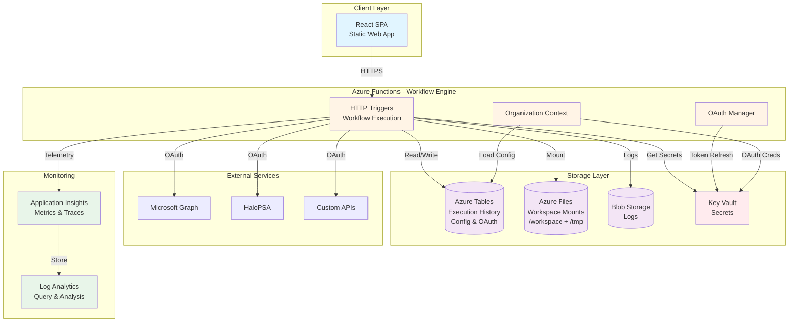

# Bifrost Integrations

**Open-source automation platform for Integration Services** - Built to democratize best-in-class tooling before venture capital gets the chance to own something we're all incredibly passionate about.

[](https://opensource.org/licenses/agpl)
[](https://azure.microsoft.com/en-us/services/functions/)
[](https://www.python.org/)
[](https://www.docker.com/)

---

## Table of Contents

-   [What is Bifrost Integrations?](#what-is-bifrost-integrations)
-   [Key Features](#key-features)
-   [Quick Start](#quick-start)
    -   [Local Development](#local-development)
    -   [Production Deployment](#production-deployment)
-   [Architecture](#architecture)
-   [Documentation](#documentation)
-   [Contributing](#contributing)
-   [License](#license)

---

## What is Bifrost Integrations?

Bifrost Integrations is an open-source automation platform designed to democratize best-in-class tooling for the emerging Integration Services industry - **before venture capital gets the chance to own something we're all incredibly passionate about: solving problems with automation**.

Built by someone with nearly 20 years of MSP experience and a deep passion for scaling solutions for the industry and its customers, this platform addresses a fundamental gap in the market. Just as early PSA and RMM tools transformed Managed Services, the Integration Services industry needs purpose-built tooling that truly scales automation. Existing RPA platforms are great for rapid development and provide helpful abstractions like OAuth, storage, and monitoring, but **they cannot and will not keep pace with AI-powered development** and have always been constrained by limitations that traditional programming languages do not have.

Bifrost Integrations removes those limitations while preserving the light management layer that makes RPA tools valuable - abstracting OAuth workflows, monitoring, configuration, and secret management. It's architected with multi-tenancy at its core, enabling you to scale your Integration Services business without duplicating work across customers. **This is not another RPA tool trying to be everything to everyone**; it's a platform designed specifically to help you build scalable automation businesses the right way.

### What You Can Do with Bifrost Integrations

**Develop with Your Favorite Tools**

-   Use VS Code, Claude Code, and Git for version control
-   Build with Python and modern development workflows
-   Test locally before deploying to production

**Build Reusable Integrations**

-   Create integration modules for common platforms (NinjaOne, HaloPSA, Pax8, Microsoft CSP)
-   Abstract authentication, pagination, and API complexity
-   Share functionality across all your workflows

**Centralized Connection Management**

-   Automated OAuth refresh flows
-   Key/value configuration storage per organization
-   Secure secrets management with Azure Key Vault

**Dynamic Forms and Workflows**

-   Create flexible forms for you and your customers
-   Build context-aware workflows that adapt based on organization and user
-   Generate form inputs programmatically from data providers

**Multi-Tenant Architecture**

-   Scope functionality globally or to specific organizations
-   Deliver value to customers without code duplication or redeployment
-   Complete data isolation between tenants

### Why Bifrost Integrations Exists

Traditional RPA tools lower the barrier to entry but fall short when you need the full power of a programming language, version control, modern development practices, and AI-assisted workflows. Meanwhile, no one is building a platform truly designed to scale automation in the way early PSA and RMM tools scaled Managed Services.

Bifrost Integrations bridges this gap by giving you the power and flexibility of code with the convenience of RPA-style abstractions - all in an open-source package that you control. **It's built to ensure the next chapter of Integration Services doesn't get ravaged by venture capitalists who prioritize extraction over value creation**.

### For the Non-Developer

With AI coding tools, proper instructions, a thriving community, and training, it's never been easier to build powerful automations. Traditional RPA tools still require you to understand programming primitives like loops, variables, and conditional logic - they had their own syntax you needed to learn. While Bifrost Integrations may require a slightly higher initial investment to get started, the combination of AI-assisted development and a platform that abstracts the dangerous complexities (authentication, secrets management, API security) means **the ceiling is dramatically higher**.

AI tools like Claude Code, GitHub Copilot, and GPT Codex can help you:

-   Write workflows from natural language descriptions
-   Debug errors and explain what code is doing
-   Suggest improvements and optimizations
-   Generate boilerplate code for common patterns

The platform handles the hard parts - OAuth flows, credential encryption, multi-tenant isolation, and API authentication - so you can focus on solving business problems. With the right guidance and AI assistance, you can build automations that would have required a full development team just a few years ago, **enabling limitless possibilities for your Integration Services business**.

---

## Quick Start

### Local Development

Get started in under 5 minutes with Docker.

#### Prerequisites

-   Docker Desktop 24+
-   Git
-   VS Code (recommended)

#### Setup

```bash
# 1. Clone the repository
git clone https://github.com/your-org/bifrost-integrations.git
cd bifrost-integrations

# 2. Build the Docker image
cd workflows
docker build -t bifrost-workflows:latest .
cd ..

# 3. Start the environment
./start.sh
```

#### Verify

```bash
# Check health endpoint
curl http://localhost:7071/api/health

# Expected response:
# {"status": "healthy", "version": "1.0.0"}
```

#### Access the Platform

-   **API**: http://localhost:7071
-   **OpenAPI Spec**: http://localhost:7071/api/openapi.json
-   **Swagger UI**: http://localhost:7071/api/docs

#### Test a Workflow

```bash
curl -X POST \
  -H "Content-Type: application/json" \
  -H "x-functions-key: test" \
  -H "X-Organization-Id: test-org-active" \
  -d '{"name": "Alice", "language": "spanish"}' \
  http://localhost:7071/api/workflows/hello_world
```

**Expected Response:**

```json
{
    "greeting": "¡Hola, Alice!",
    "language": "spanish",
    "organization": "Test Organization"
}
```

👉 **See [client/public/docs/local-development.md](client/public/docs/local-development.md) for complete local development guide**

---

## Production Deployment

Deploy Bifrost Integrations to Azure using GitHub Actions. Infrastructure deployment takes ~10-15 minutes, with automatic deployments on every push to main.

[](https://portal.azure.com/#create/Microsoft.Template/uri/https%3A%2F%2Fraw.githubusercontent.com%2Fyour-org%2Fbifrost-integrations%2Fmain%2Fdeployment%2Fazuredeploy.json)

### Prerequisites

-   **Azure Subscription** - With Owner or Contributor permissions
-   **GitHub Repository** - Fork or clone this repository to your GitHub account

### Architecture Overview

The production deployment creates the following Azure resources:



### Deployment Steps

#### 1. Deploy Infrastructure to Azure

Click the "Deploy to Azure" button above and fill in the form:

| Parameter               | Description                                         | Default         | Required |
| ----------------------- | --------------------------------------------------- | --------------- | -------- |
| **Subscription**        | Azure subscription for billing                      | -               | ✓        |
| **Resource Group**      | Container for all resources (will be created)       | bifrost-prod-rg | ✓        |
| **Region**              | Azure region (eastus recommended)                   | eastus          | ✓        |
| **Base Name**           | Prefix for resource names (made unique with suffix) | bifrost         | ✓        |
| **Workspaces Quota GB** | Azure Files workspace share size                    | 100             | ✓        |
| **Tmp Quota GB**        | Azure Files tmp share size                          | 50              | ✓        |

Click **Review + create**, then **Create**. Deployment takes ~10-15 minutes and creates:

-   Azure Functions (Consumption plan)
-   Storage Account (Tables, Blobs, Files)
-   Key Vault
-   Application Insights
-   Log Analytics


<!-- TODO: Add screenshot of Azure Portal custom deployment form -->

**Save these deployment outputs** (found in Outputs tab):

-   `functionAppName` - Needed for GitHub Actions
-   `functionAppUrl` - API endpoint
-   `keyVaultName` - For secrets management
-   `storageAccountName` - For storage access
-   `resourceGroupName` - For GitHub Actions


<!-- TODO: Add screenshot of deployment outputs tab -->

#### 2. Create Static Web App

In Azure Portal:

1. Go to **Create a resource** → Search **Static Web App**
2. Fill in the form:
    - **Resource Group**: Use the same as Functions
    - **Name**: `bifrost-swa-{unique-suffix}`
    - **Plan**: Free
    - **Deployment source**: GitHub
    - **Repository**: Select your forked repository
    - **Branch**: main
    - **Build Presets**: Custom
    - **App location**: `/client`
    - **Output location**: `dist`
3. Click **Review + create**, then **Create**

Azure will:

-   Create a GitHub Actions workflow in your repository
-   Deploy the frontend automatically
-   Provide a public URL


<!-- TODO: Add screenshot of Static Web App creation form -->

#### 3. Configure GitHub Secrets

In your GitHub repository, go to **Settings** → **Secrets and variables** → **Actions** and add:

| Secret Name                         | Value                | How to Get                                                      |
| ----------------------------------- | -------------------- | --------------------------------------------------------------- |
| `AZURE_FUNCTIONAPP_NAME`            | Function App name    | From deployment outputs (step 1)                                |
| `AZURE_FUNCTIONAPP_PUBLISH_PROFILE` | Publish profile XML  | Download from Azure Portal → Function App → Get publish profile |
| `AZURE_STATIC_WEB_APPS_API_TOKEN`   | SWA deployment token | Azure Portal → Static Web App → Manage deployment token         |

**To get the publish profile:**

1. Navigate to your Function App in Azure Portal
2. Click **Download publish profile** (top toolbar)
3. Open the `.PublishSettings` file in a text editor
4. Copy the entire XML contents
5. Paste into GitHub secret `AZURE_FUNCTIONAPP_PUBLISH_PROFILE`


<!-- TODO: Add screenshot of GitHub secrets page -->

#### 4. Deploy Functions and Frontend

Push to main branch or manually trigger workflows:

```bash
git push origin main
```

Or trigger manually in GitHub:

1. Go to **Actions** tab
2. Select **Deploy Azure Functions** or **Deploy Static Web App**
3. Click **Run workflow**

GitHub Actions will:

-   Build the Functions code
-   Deploy to Azure Functions (Consumption plan)
-   Build the React frontend
-   Deploy to Static Web App


<!-- TODO: Add screenshot of GitHub Actions workflows running -->

#### 5. Verify Deployment

Use the `functionAppUrl` from deployment outputs:

```bash
# Test the health endpoint (replace with your function app URL)
curl https://bifrost-func-xyz.azurewebsites.net/api/health

# Expected response:
# {"status": "healthy", "version": "1.0.0"}
```


<!-- TODO: Add screenshot of Postman or browser showing successful health check -->

You can also verify in Azure Portal:

1. Navigate to your resource group
2. Click the Function App resource
3. Go to **Functions** → Select any function → Click **Test/Run**


<!-- TODO: Add screenshot of Azure Portal showing deployed resources -->

### Post-Deployment Configuration

#### 1. Configure GitHub Webhook

Navigate to your GitHub repository settings:

1. Go to **Settings** → **Webhooks** → **Add webhook**
2. **Payload URL**: Use the `githubWebhookUrl` from deployment outputs
3. **Content type**: `application/json`
4. **Secret**: Retrieve from Key Vault (see below)
5. **Events**: Select "Just the push event"
6. Click **Add webhook**


<!-- TODO: Add screenshot of GitHub webhook configuration page -->

**Retrieve Webhook Secret:**

```bash
# Replace bifrost-kv-xyz with your keyVaultName from deployment outputs
az keyvault secret show \
  --vault-name bifrost-kv-xyz \
  --name github-webhook-secret-global \
  --query value \
  --output tsv
```

Or retrieve directly from Azure Portal:

1. Navigate to your Key Vault resource
2. Go to **Secrets** → Find `github-webhook-secret-global`
3. Click the secret → Click **Show Secret Value**

#### 2. Upload OAuth Credentials

For integrations requiring OAuth (HaloPSA, Microsoft Graph, etc.):

```bash
# Replace bifrost-kv-xyz with your keyVaultName from deployment outputs

# Example: Store HaloPSA OAuth credentials
az keyvault secret set \
  --vault-name bifrost-kv-xyz \
  --name oauth-halopsa-client-id \
  --value "your-client-id"

az keyvault secret set \
  --vault-name bifrost-kv-xyz \
  --name oauth-halopsa-client-secret \
  --value "your-client-secret"
```

Or use Azure Portal:

1. Navigate to your Key Vault resource
2. Go to **Secrets** → Click **Generate/Import**
3. Enter secret name and value
4. Click **Create**


<!-- TODO: Add screenshot of Azure Key Vault showing secrets -->

#### 3. Configure Organization Settings

Access the `staticWebAppUrl` from deployment outputs and configure:

1. **Organizations**: Add your organizations
2. **OAuth Connections**: Connect external APIs
3. **Configuration**: Set organization-specific key/value pairs
4. **Users & Roles**: Assign permissions


<!-- TODO: Add screenshot of platform configuration interface -->

### Monitoring & Troubleshooting

#### Application Insights

View logs, metrics, and performance data:

1. Navigate to **Azure Portal** → **Resource Groups** → Your resource group
2. Click **Application Insights** resource
3. View **Live Metrics**, **Failures**, and **Performance** tabs


<!-- TODO: Add screenshot of Application Insights showing metrics -->

**Quick links from deployment outputs:**

-   Use `functionAppName` to find your Function App
-   Use `storageAccountName` to find your Storage Account
-   Use `keyVaultName` to find your Key Vault

#### Function App Logs

Stream real-time logs using Azure CLI:

```bash
# Replace with your functionAppName and resource group from deployment
az webapp log tail \
  --name bifrost-func-xyz \
  --resource-group bifrost-prod-rg
```

Or view in Azure Portal:

1. Navigate to your Function App resource
2. Go to **Monitoring** → **Log stream**
3. View real-time logs

#### Common Issues

**Issue: Container won't start**

-   Check Docker Hub image is accessible and public
-   Verify container image name matches what you entered in deployment form
-   Review Function App logs in Azure Portal (Monitoring → Log stream)
-   Check Application Settings in Function App configuration

**Issue: Health check fails**

-   Verify Azure Files shares mounted correctly (check `/workspace` and `/tmp` mounts)
-   Check Application Settings → `AzureWebJobsStorage` is populated
-   Ensure Storage Account firewall allows Function App access
-   Review Function App logs for mount or connection errors

**Issue: Static Web App deployment fails**

-   Verify GitHub token has `repo` and `workflow` scopes
-   Check GitHub Actions workflow logs in your repository
-   Ensure frontend directory path (`/client`) is correct
-   Confirm GitHub repository URL is accessible

**Issue: Function App shows "502 Bad Gateway"**

-   Wait 5-10 minutes for initial container pull and startup
-   Check Docker Hub rate limits haven't been exceeded
-   Review Function App → Configuration → Container settings
-   Verify environment variables are set correctly

**Issue: Can't access deployment outputs**

-   Navigate to Azure Portal → Resource Groups → Your resource group
-   Click **Deployments** in left sidebar
-   Click the most recent deployment
-   Click **Outputs** tab to see all values

---

## Architecture

Bifrost Integrations uses a modern, scalable architecture built on Azure services:

### Components

```
┌─────────────────┐    ┌─────────────────┐    ┌─────────────────┐
│   Frontend      │    │   Backend       │    │   Integrations  │
│   (React SPA)   │    │   (Azure        │    │   (External     │
│                 │    │   Functions)    │    │   APIs)         │
├─────────────────┤    ├─────────────────┤    ├─────────────────┤
│ • Form Builder  │◄──►│ • Workflow      │◄──►│ • Microsoft     │
│ • Execution UI  │    │   Engine        │    │   Graph         │
│ • Monitoring    │    │ • Context API   │    │ • HaloPSA       │
│ • Admin Panel   │    │ • OAuth Manager │    │ • Pax8          │
└─────────────────┘    └─────────────────┘    └─────────────────┘
         │                       │                       │
         └───────────────────────┼───────────────────────┘
                                 │
                    ┌─────────────────┐
                    │   Data Layer    │
                    │                 │
                    │ • Azure Tables  │
                    │ • Azure Files   │
                    │ • Key Vault     │
                    │ • Blob Storage  │
                    └─────────────────┘
```

### Azure Resources

| Resource                 | Purpose                                 | SKU                    |
| ------------------------ | --------------------------------------- | ---------------------- |
| **Azure Functions**      | Workflow engine runtime (Python 3.11)   | Consumption (Y1)       |
| **Static Web App**       | Frontend hosting + GitHub Actions CI/CD | Free                   |
| **Storage Account**      | Tables, Blobs, Files (workspace mounts) | Standard LRS, Hot tier |
| **Key Vault**            | Secrets management                      | Standard               |
| **Application Insights** | Monitoring and telemetry                | Pay-as-you-go          |
| **Log Analytics**        | Log aggregation                         | Pay-as-you-go          |

### Cost Estimates

**Typical Production Deployment:**

-   **Azure Functions (Consumption)**: $0-5/month
-   First 1M executions free, then $0.20 per million
-   First 400,000 GB-s free, then $0.000016 per GB-s
-   Example: 50k executions/month = $0.01
-   **Storage Account**: $2-5/month
-   Tables: $0.05 per GB
-   Files (100 GB): ~$2.30
-   Blobs: $0.02 per GB
-   **Key Vault**: $0.50/month (10k operations free, then $0.03 per 10k)
-   **Application Insights**: $2-5/month (first 5 GB free)
-   **Static Web App**: $0 (Free tier)

**Total: ~$5-15/month for small-to-medium workloads**

**Cost grows with:**

-   Number of workflow executions (pay-per-use)
-   Storage used (Tables, Files, Blobs)
-   Application Insights data ingestion

**Example scenarios:**

-   **5 customers, 10k executions/month**: ~$5-7/month
-   **25 customers, 100k executions/month**: ~$10-15/month
-   **100 customers, 500k executions/month**: ~$25-35/month

**Note**: Consumption plan means you only pay for what you use. Monitor costs in Azure Cost Management.

---

## Documentation

### Getting Started

-   **[Getting Started Guide](client/public/docs/getting-started.md)** - Introduction and first workflow
-   **[Local Development Guide](client/public/docs/local-development.md)** - Docker setup and API testing
-   **[Production Deployment](specs/005-migrate-to-azure/quickstart.md)** - Detailed deployment guide

### Workflow Development

-   **[Workflow Development Guide](client/public/docs/workflow-development.md)** - Creating workflows
-   **[Forms and Configuration](client/public/docs/forms-and-config.md)** - Dynamic forms
-   **[Permissions and Roles](client/public/docs/permissions-and-roles.md)** - Access control
-   **[Secrets and OAuth](client/public/docs/secrets-and-oauth.md)** - OAuth integrations

### Platform Guides

-   **[Platform Overview](client/public/docs/platform-overview.md)** - Architecture and concepts
-   **[AI Agent Usage](client/public/docs/ai-agent-usage.md)** - AI-assisted development
-   **[Troubleshooting](client/public/docs/Troubleshooting/)** - Common issues

### API Reference

-   **OpenAPI Spec**: `/api/openapi.json` (when running)
-   **Swagger UI**: `/api/docs` (when running)

---

## Project Structure

```
bifrost-integrations/
├── workflows/                     # Azure Functions backend
│   ├── engine/                    # Core platform code
│   │   ├── shared/                # Context, decorators, utilities
│   │   ├── data_providers/        # Data provider functions
│   │   └── functions/             # HTTP-triggered Azure Functions
│   ├── workspace/                 # User workflow files
│   │   └── workflows/             # Custom workflows
│   ├── Dockerfile                 # Container image definition
│   ├── requirements.txt           # Python dependencies
│   └── function_app.py            # Azure Functions entry point
├── client/                        # React frontend
│   ├── src/                       # React components
│   └── public/docs/               # Platform documentation
├── deployment/                    # Azure deployment files
│   ├── azuredeploy.json           # ARM template for infrastructure
│   └── parameters/                # Environment-specific parameters
├── scripts/                       # Deployment scripts
│   └── deploy-production.sh       # Production deployment script
├── specs/                         # Feature specifications
└── example_clean_workspace/       # Example local setup
```

---

## Contributing

We welcome contributions! Please see our [Contributing Guide](CONTRIBUTING.md) for details.

### Development Workflow

1. Fork the repository
2. Create a feature branch (`git checkout -b feature/amazing-feature`)
3. Make your changes
4. Test locally with Docker
5. Commit your changes (`git commit -m 'Add amazing feature'`)
6. Push to your fork (`git push origin feature/amazing-feature`)
7. Open a Pull Request

### Code Standards

-   **Python**: Follow PEP 8 style guide
-   **TypeScript/React**: Follow Airbnb style guide
-   **Commits**: Use conventional commit messages
-   **Tests**: Write tests for new features

---

## License

This project is licensed under the MIT License - see the [LICENSE](LICENSE) file for details.

---

## Community & Support

-   **GitHub Issues**: [Report bugs or request features](https://github.com/your-org/bifrost-integrations/issues)
-   **Discussions**: [Ask questions and share ideas](https://github.com/your-org/bifrost-integrations/discussions)
-   **Discord**: [Join our community](https://discord.gg/your-invite-link) _(Coming soon)_

---

## Acknowledgments

Built with ❤️ for the Integration Services industry by someone who's been there for nearly 20 years. This is our chance to build something that works for us, not for venture capitalists.

**Special thanks to:**

-   The MSP community for inspiration and feedback
-   Open-source contributors who make projects like this possible
-   Azure and Microsoft for providing accessible cloud infrastructure

---

## Roadmap

### Current (v1.0)

-   ✅ Docker-based local development
-   ✅ Azure Functions workflow engine
-   ✅ Multi-tenant architecture
-   ✅ OAuth connection management
-   ✅ Dynamic forms and data providers
-   ✅ Production deployment via ARM templates + GitHub Actions

### Coming Soon (v1.1-1.2)

-   🔲 Pre-built integrations (Microsoft Graph, HaloPSA, Pax8)
-   🔲 Workflow marketplace
-   🔲 Enhanced monitoring dashboards
-   🔲 Scheduled workflow execution
-   🔲 Webhook triggers
-   🔲 Advanced error handling and retry logic

### Future (v2.0+)

-   🔲 Workflow versioning
-   🔲 Visual workflow editor
-   🔲 Workflow testing framework
-   🔲 Performance optimization tools
-   🔲 Advanced multi-region support

---

**Ready to get started?** Choose your path:

-   🚀 [Local Development →](client/public/docs/local-development.md)
-   ☁️ [Production Deployment →](specs/005-migrate-to-azure/quickstart.md)
-   📚 [Read the Docs →](client/public/docs/getting-started.md)
