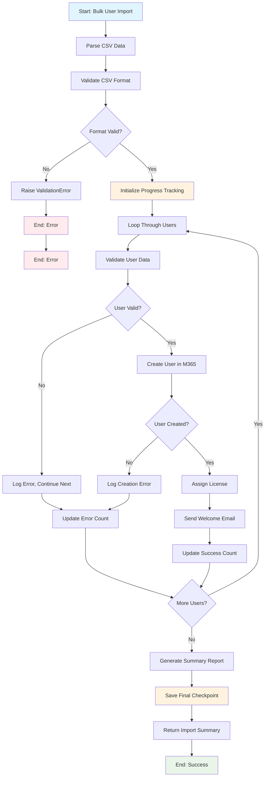

# AI Agent Development Guide

This guide helps AI agents assist developers in creating custom workflows, integrations, and automation within the Bifrost Integrations platform.

## 🚨 CRITICAL RULES

### WHERE TO WRITE CODE
**⚠️ ABSOLUTE RULE**: ALL workflow and user code MUST be written **ONLY** in the `/workspace/` directory. NEVER modify files in `/engine/` as they contain system infrastructure code.

### RECOMMENDED FOLDER STRUCTURE

```
/workspace/
├── workflows/                    # All workflow implementations
│   ├── user_management/         # Organized by category
│   │   ├── create_user/
│   │   │   ├── workflow.py       # Main workflow implementation
│   │   │   ├── diagram.mmd       # Mermaid diagram (auto-generated)
│   │   │   ├── lib/              # Workflow-specific utilities
│   │   │   │   ├── __init__.py
│   │   │   │   ├── helpers.py
│   │   │   │   └── validators.py
│   │   │   └── tests/            # Workflow-specific tests
│   │   │       ├── __init__.py
│   │   │       └── test_workflow.py
│   │   ├── disable_user/
│   │   │   ├── workflow.py
│   │   │   ├── diagram.mmd
│   │   │   ├── lib/
│   │   │   │   └── __init__.py
│   │   │   └── tests/
│   │   │       └── __init__.py
│   │   └── reset_password/
│   ├── automation/
│   │   ├── daily_report/
│   │   │   ├── workflow.py
│   │   │   ├── diagram.mmd
│   │   │   ├── lib/
│   │   │   │   ├── __init__.py
│   │   │   │   └── report_helpers.py
│   │   │   └── tests/
│   │   │       └── __init__.py
│   │   ├── cleanup_temp/
│   │   └── license_audit/
│   ├── integration/
│   │   ├── halo_sync/
│   │   │   ├── workflow.py
│   │   │   ├── diagram.mmd
│   │   │   ├── lib/
│   │   │   │   ├── __init__.py
│   │   │   │   └── halo_client.py
│   │   │   └── tests/
│   │   │       └── __init__.py
│   │   └── msgraph_import/
│   └── examples/                 # Template and example workflows
│       ├── hello_world/
│       │   ├── workflow.py
│       │   ├── diagram.mmd
│       │   ├── lib/
│       │   │   └── __init__.py
│       │   └── tests/
│       │       └── __init__.py
│       └── error_handling/
├── data_providers/              # Reusable data providers
│   ├── __init__.py
│   ├── get_departments.py
│   ├── get_licenses.py
│   └── get_sites.py
├── integrations/                # Custom integration clients
│   ├── __init__.py
│   ├── custom_api.py
│   └── internal_system.py
├── utils/                       # Shared utilities
│   ├── __init__.py
│   ├── formatters.py
│   ├── validators.py
│   └── helpers.py
└── tests/                       # Global tests
    ├── __init__.py
    ├── test_workflows.py
    └── test_integrations.py
```

**Benefits of this structure**:
- 🎯 **Organized by category** - Easy to find related workflows
- 📊 **Auto-generated diagrams** - Visual workflow documentation
- 🔧 **Workflow-specific libraries** - Isolated helper functions
- 🧪 **Workflow-specific tests** - Focused testing
- 📦 **Reusable components** - Shared data providers and utilities
- 📁 **Proper Python packages** - All directories have `__init__.py` files

### MERMAID DIAGRAM GENERATION

Every workflow should include an auto-generated Mermaid diagram in `diagram.mmd` that visually represents the workflow flow:

```mermaid
# /workspace/workflows/user_management/create_user/diagram.mmd
flowchart TD
    A[Start: Create User] --> B[Validate Input Parameters]
    B --> C{Email Valid?}
    C -->|No| D[Raise ValidationError]
    C -->|Yes| E[Get MS Graph Integration]
    E --> F[Check if User Exists]
    F --> G{User Exists?}
    G -->|Yes| H[Return Error: User Already Exists]
    G -->|No| I[Create User in M365]
    I --> J[Assign License]
    J --> K[Send Welcome Email]
    K --> L[Save Checkpoint: User Created]
    L --> M[Return Success Response]
    D --> N[End: Error]
    H --> N
    M --> O[End: Success]
    
    style A fill:#e1f5fe
    style O fill:#e8f5e8
    style N fill:#ffebee
```

**Diagram Generation Guidelines**:
- 🔄 **Auto-generate** - Create diagrams automatically when implementing workflows
- 📊 **Flowchart format** - Use Mermaid flowchart syntax
- 🎯 **Decision points** - Show conditional logic with diamonds
- ✅ **Success/error paths** - Clearly indicate happy path and error handling
- 📍 **Checkpoints** - Mark where `context.save_checkpoint()` is called
- 🔗 **Integration calls** - Show external system interactions
- 📝 **Keep updated** - Update diagram when workflow logic changes

**Diagram Best Practices**:
1. **Start/End nodes** - Use clear start and end points
2. **Color coding** - Use colors to indicate success (green), error (red), and neutral (blue) states
3. **Descriptive labels** - Use clear, action-oriented node descriptions
4. **Error handling** - Show all error paths and exception handling
5. **Integration points** - Mark where external APIs/services are called
6. **Checkpoints** - Indicate where state is saved for debugging

**Example Complex Workflow Diagram**:


```
✅ ALLOWED: /workspace/workflows/user_management/create_user/workflow.py
✅ ALLOWED: /workspace/data_providers/get_departments.py
✅ ALLOWED: /workspace/utils/helpers.py

❌ FORBIDDEN: /engine/shared/storage.py
❌ FORBIDDEN: /engine/functions/execute.py
❌ FORBIDDEN: /engine/admin/metadata.py
```

### IMPORT RESTRICTIONS
Workspace code can ONLY import from these specific modules:

```python
# ✅ ALLOWED - Public API for workspace code
from engine.shared.decorators import workflow, param, data_provider
from engine.shared.context import OrganizationContext
from engine.shared.error_handling import (
    WorkflowException, ValidationError, IntegrationError, 
    TimeoutError, ConfigurationError, PermissionError
)
from engine.shared.models import (
    WorkflowMetadata, DataProviderMetadata, OAuthCredentials,
    Organization, User, FormField, etc.
)

# ❌ FORBIDDEN - Internal engine modules (will be blocked at runtime)
from engine.shared.storage import TableStorageService
from engine.shared.auth import AuthService
from engine.shared.keyvault import KeyVaultClient
from engine.functions.execute import execute_workflow_internal
```

## WORKFLOW DEVELOPMENT

### Basic Workflow Structure

```python
# /workspace/workflows/my_workflow.py
from engine.shared.decorators import workflow, param
from engine.shared.context import OrganizationContext

@workflow(
    name="my_workflow",
    description="Clear description of what this workflow does",
    category="user_management",  # Categories: user_management, automation, reporting, etc.
    tags=["m365", "automation"],  # Optional tags for filtering
    
    # Execution settings
    execution_mode="sync",  # "sync", "async", "scheduled"
    timeout_seconds=300,   # Max execution time
    
    # Access control
    requires_org=True,      # Requires organization context?
    expose_in_forms=True,   # Can be called from forms?
)
@param("user_email", "email", "User email address", required=True)
@param("department", "string", "Department name", 
       data_provider="get_departments")  # Dynamic options
async def my_workflow(context: OrganizationContext, user_email: str, department: str):
    """
    Workflow implementation.
    
    Args:
        context: Organization context with access to org data, config, secrets
        user_email: User's email address
        department: Department name (from dropdown)
    
    Returns:
        dict: Workflow result
    """
    # Log execution start
    context.log("info", f"Processing user: {user_email}", {"department": department})
    
    # Save checkpoint for debugging
    context.save_checkpoint("user_validation", {"email": user_email})
    
    try:
        # Your workflow logic here
        result = await process_user(context, user_email, department)
        
        context.log("info", "Workflow completed successfully")
        return {"success": True, "result": result}
        
    except Exception as e:
        context.log("error", "Workflow failed", {"error": str(e)})
        raise WorkflowException(f"Failed to process user: {str(e)}")
```

### Parameter Types and Validation

```python
@param("name", "string", "Full name", required=True,
       validation={"min": 2, "max": 100})
@param("age", "int", "User age", required=False,
       validation={"min": 18, "max": 120})
@param("is_active", "bool", "Account status", default_value=True)
@param("license_type", "string", "License type",
       data_provider="get_available_licenses")
@param("notes", "string", "Additional notes",
       help_text="Enter any additional information here")
```

**Valid Parameter Types**:
- `string` - Text values
- `int` - Integer numbers
- `bool` - True/False values
- `float` - Decimal numbers
- `email` - Email addresses (with validation)
- `json` - JSON objects
- `list` - Arrays/lists

## CONTEXT API REFERENCE

### Organization Information
```python
org_id = context.org_id           # Organization ID
org_name = context.org_name       # Organization display name
tenant_id = context.tenant_id     # Microsoft 365 tenant ID
```

### Execution Metadata
```python
execution_id = context.execution_id
caller_email = context.executed_by_email
caller_name = context.executed_by_name
```

### Configuration (with Secret Resolution)
```python
# Get config value (automatically resolves secret_ref from Key Vault)
api_url = context.get_config("api_url", "https://default.com")
api_key = context.get_config("api_key")  # Fetches from Key Vault if secret_ref

# Check if config exists
if context.has_config("feature_flag"):
    # Use feature
    pass
```

### Secrets (Direct Key Vault Access)
```python
# Secrets are org-scoped: {org_id}--{secret_name}
secret_value = await context.get_secret("my_secret")
```

### OAuth Connections
```python
# Get pre-authenticated OAuth credentials
oauth_creds = await context.get_oauth_connection("HaloPSA")
headers = {"Authorization": oauth_creds.get_auth_header()}

# Check if token is expired
if oauth_creds.is_expired():
    context.log("warning", "OAuth token expired")
```

### Integrations (When Available)
```python
# Get pre-authenticated integration clients
graph = context.get_integration("msgraph")  # Microsoft Graph
halo = context.get_integration("halopsa")  # HaloPSA

# Use immediately - already authenticated
users = await graph.get_users()
tickets = await halo.get_tickets()
```

### State Tracking
```python
# Save checkpoints for debugging
context.save_checkpoint("step1", {"progress": "started", "user_id": user_id})

# Workflow variables (persisted in execution record)
context.set_variable("processed_count", 42)
count = context.get_variable("processed_count", 0)

# Logging (persisted in execution record)
context.log("info", "Processing started", {"user_id": user_id})
context.log("warning", "Rate limit approaching", {"remaining": 10})
context.log("error", "API call failed", {"error": str(e)})
```

## DATA PROVIDERS

Data providers supply dynamic options for form fields:

```python
# /workspace/workflows/data_providers.py
from engine.shared.decorators import data_provider
from engine.shared.context import OrganizationContext

@data_provider(
    name="get_departments",
    description="Get list of departments for the organization",
    category="organization",
    cache_ttl_seconds=300  # Cache for 5 minutes
)
async def get_departments(context: OrganizationContext):
    """Return department options for form dropdown."""
    # Example: Return from config or external API
    departments = context.get_config("departments", "IT,HR,Finance").split(",")
    
    return [
        {"label": dept.strip(), "value": dept.strip()}
        for dept in departments
    ]

@data_provider(
    name="get_available_licenses",
    description="Get available Microsoft 365 licenses",
    category="m365"
)
async def get_available_licenses(context: OrganizationContext):
    """Return available M365 licenses from Microsoft Graph."""
    try:
        graph = context.get_integration("msgraph")
        skus = await graph.get_subscribed_skus()
        
        return [
            {
                "label": sku.sku_part_number,
                "value": sku.sku_id,
                "metadata": {
                    "available": sku.prepaid_units.enabled - sku.consumed_units,
                    "price": sku.prepaid_units.enabled
                }
            }
            for sku in skus.value
            if sku.prepaid_units.enabled > sku.consumed_units
        ]
    except Exception as e:
        context.log("error", "Failed to get licenses", {"error": str(e)})
        return []
```

## ERROR HANDLING

Use structured error handling for better debugging:

```python
from engine.shared.error_handling import (
    ValidationError, IntegrationError, TimeoutError, 
    ConfigurationError, PermissionError, WorkflowException
)

@workflow(name="robust_workflow")
async def robust_workflow(context: OrganizationContext, user_email: str):
    # Input validation
    if not user_email or "@" not in user_email:
        raise ValidationError("Invalid email address", field="user_email")
    
    # Configuration validation
    if not context.has_config("api_endpoint"):
        raise ConfigurationError(
            "API endpoint not configured",
            config_key="api_endpoint"
        )
    
    # Integration calls with error handling
    try:
        graph = context.get_integration("msgraph")
        user = await graph.get_user(user_email)
    except Exception as e:
        raise IntegrationError(
            integration="msgraph",
            message=f"Failed to get user: {str(e)}",
            status_code=getattr(e, 'status_code', None)
        )
    
    return {"user": user}
```

## SCHEDULED WORKFLOWS

Create automated workflows that run on schedules:

```python
@workflow(
    name="daily_license_audit",
    description="Daily audit of Microsoft 365 licenses",
    category="automation",
    execution_mode="scheduled",
    schedule="0 9 * * *",  # Every day at 9 AM UTC
    expose_in_forms=False,  # Cannot be called from forms
    timeout_seconds=600
)
async def daily_license_audit(context: OrganizationContext):
    """Automated daily license audit."""
    context.log("info", "Starting daily license audit")
    
    graph = context.get_integration("msgraph")
    skus = await graph.get_subscribed_skus()
    
    unused_licenses = []
    for sku in skus.value:
        available = sku.prepaid_units.enabled - sku.consumed_units
        if available > 0:
            unused_licenses.append({
                "sku": sku.sku_part_number,
                "available": available
            })
    
    context.save_checkpoint("audit_complete", {
        "total_skus": len(skus.value),
        "unused_count": len(unused_licenses)
    })
    
    return {"unused_licenses": unused_licenses}
```

**Cron Schedule Examples**:
- `"0 9 * * *"` - Every day at 9 AM UTC
- `"*/15 * * * *"` - Every 15 minutes
- `"0 0 * * 1"` - Every Monday at midnight
- `"0 9 * * 1-5"` - Weekdays at 9 AM
- `"0 0 1 * *"` - First day of month at midnight

## ASYNC WORKFLOWS

For long-running operations:

```python
@workflow(
    name="bulk_user_import",
    description="Import multiple users from CSV",
    execution_mode="async",  # Runs in background
    timeout_seconds=1800,   # 30 minutes
)
async def bulk_user_import(context: OrganizationContext, csv_data: str):
    """Import users from CSV data."""
    import csv
    from io import StringIO
    
    context.log("info", "Starting bulk user import")
    
    # Parse CSV
    csv_reader = csv.DictReader(StringIO(csv_data))
    users = list(csv_reader)
    
    context.set_variable("total_users", len(users))
    context.set_variable("processed_users", 0)
    context.set_variable("failed_users", [])
    
    results = []
    for i, user_data in enumerate(users):
        try:
            # Process each user
            result = await create_user(context, user_data)
            results.append(result)
            
            # Update progress
            context.set_variable("processed_users", i + 1)
            context.save_checkpoint(f"user_{i+1}", {"email": user_data.get("email")})
            
        except Exception as e:
            failed = context.get_variable("failed_users", [])
            failed.append({"email": user_data.get("email"), "error": str(e)})
            context.set_variable("failed_users", failed)
    
    summary = {
        "total": len(users),
        "processed": context.get_variable("processed_users"),
        "failed": len(context.get_variable("failed_users", [])),
        "results": results
    }
    
    context.log("info", "Bulk import completed", summary)
    return summary
```

## CUSTOM INTEGRATIONS

Create new integration clients:

```python
# /workspace/integrations/custom_api.py
from engine.shared.integrations.base import BaseIntegration
from engine.shared.error_handling import IntegrationError
import aiohttp

class CustomAPIIntegration(BaseIntegration):
    integration_name = "custom_api"
    
    async def authenticate(self):
        """Authenticate to custom API."""
        api_key = await self.get_secret("custom_api_key")
        base_url = self.get_config("custom_api_url")
        
        self.base_url = base_url
        self.headers = {"Authorization": f"Bearer {api_key}"}
        
        return api_key
    
    async def get_data(self, endpoint: str):
        """Get data from API endpoint."""
        started_at = datetime.utcnow()
        url = f"{self.base_url}{endpoint}"
        
        try:
            async with aiohttp.ClientSession() as session:
                async with session.get(url, headers=self.headers) as response:
                    data = await response.json()
                    
                    # Track successful call
                    duration_ms = int((datetime.utcnow() - started_at).total_seconds() * 1000)
                    self.context._track_integration_call(
                        integration="custom_api",
                        method="GET",
                        endpoint=endpoint,
                        status_code=response.status,
                        duration_ms=duration_ms
                    )
                    
                    return data
                    
        except Exception as e:
            # Track failed call
            duration_ms = int((datetime.utcnow() - started_at).total_seconds() * 1000)
            self.context._track_integration_call(
                integration="custom_api",
                method="GET",
                endpoint=endpoint,
                status_code=500,
                duration_ms=duration_ms,
                error=str(e)
            )
            
            raise IntegrationError(
                integration="custom_api",
                message=f"API call failed: {str(e)}"
            )

# Register the integration (in __init__.py or similar)
from engine.shared.integrations.base import register_integration
register_integration("custom_api", CustomAPIIntegration)
```

## TESTING PATTERNS

### Unit Testing with Mock Context

```python
# /workspace/tests/test_my_workflow.py
import pytest
from unittest.mock import AsyncMock, MagicMock
from workflows.my_workflow import my_workflow

@pytest.mark.asyncio
async def test_my_workflow_success():
    # Mock context
    context = MagicMock()
    context.org_id = "test-org"
    context.org_name = "Test Organization"
    context.get_config = MagicMock(return_value="test_value")
    context.log = MagicMock()
    context.save_checkpoint = MagicMock()
    
    # Mock integration
    mock_graph = AsyncMock()
    mock_graph.get_user = AsyncMock(return_value={"id": "user-123", "email": "test@example.com"})
    context.get_integration = MagicMock(return_value=mock_graph)
    
    # Execute workflow
    result = await my_workflow(context, "test@example.com")
    
    # Assert
    assert result["success"] is True
    mock_graph.get_user.assert_called_once_with("test@example.com")
    context.log.assert_called()
```

### Local Development Testing

```bash
# 1. Start local environment
azurite --silent --location /tmp/azurite
python scripts/seed_azurite.py
func start

# 2. Test workflow
curl -X POST \
  -H "Content-Type: application/json" \
  -H "X-Organization-Id: test-org-active" \
  -d '{"user_email": "test@example.com"}' \
  http://localhost:7072/api/workflows/my_workflow
```

## BEST PRACTICES

### 1. Workflow Design
- Keep workflows focused on single responsibilities
- Use descriptive names and categories
- Add comprehensive parameter validation
- Log important steps and decisions
- Save checkpoints at key milestones

### 2. Error Handling
- Use specific exception types
- Include context in error messages
- Log errors before raising exceptions
- Provide actionable error details

### 3. Performance
- Use async/await for I/O operations
- Cache expensive operations in variables
- Limit data processing to necessary items
- Set appropriate timeouts

### 4. Security
- Never log sensitive data (passwords, tokens)
- Use context.get_secret() for credentials
- Validate all input parameters
- Follow principle of least privilege

### 5. Maintainability
- Add clear docstrings
- Use type hints
- Break complex logic into helper functions
- Add comments for non-obvious code

## TROUBLESHOOTING

### Common Issues

1. **Import Error**: "Workspace code cannot import engine module"
   - Solution: Only import from allowed modules listed above

2. **Workflow Not Found**: 404 when executing workflow
   - Solution: Ensure workflow is in `/workspace/workflows/` and has `@workflow` decorator

3. **Secret Access Failed**: KeyVault permission denied
   - Solution: Run `python scripts/authenticate_azure.py` and check Key Vault permissions

4. **Timeout Error**: Workflow exceeds time limit
   - Solution: Increase `timeout_seconds` in `@workflow` decorator or optimize workflow

### Debugging Tips

```python
# Add debug checkpoints
context.save_checkpoint("debug_point", {
    "variable": variable_value,
    "step": "processing_data"
})

# Use structured logging
context.log("info", "Debug info", {
    "user_id": user_id,
    "data_length": len(data),
    "processing_step": "validation"
})

# Set workflow variables for inspection
context.set_variable("debug_data", complex_object)
```

## QUICK REFERENCE

### Essential Imports
```python
from engine.shared.decorators import workflow, param, data_provider
from engine.shared.context import OrganizationContext
from engine.shared.error_handling import (
    ValidationError, IntegrationError, WorkflowException
)
```

### Workflow Template
```python
@workflow(name="workflow_name", description="Description")
@param("param1", "string", "Parameter 1", required=True)
async def workflow_name(context: OrganizationContext, param1: str):
    context.log("info", "Starting workflow")
    # Your logic here
    return {"result": "success"}
```

### Context Methods
```python
context.get_config(key, default)
context.has_config(key)
await context.get_secret(key)
await context.get_oauth_connection(name)
context.get_integration(name)
context.log(level, message, data)
context.save_checkpoint(name, data)
context.set_variable(key, value)
context.get_variable(key, default)
```

This guide provides everything needed to create robust, secure, and maintainable workflows in the Bifrost Integrations platform.